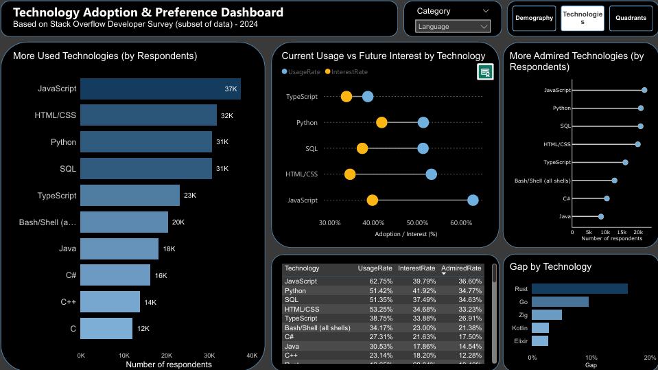

# Análisis de Tecnologías en TI | Fase 5: Visualización y Presentación

Este proyecto presenta un dashboard interactivo desarrollado a partir de datos del **Stack Overflow Developer Survey 2024** (subconjunto).  

El objetivo es analizar la adopción, el interés y la satisfacción de distintas tecnologías para identificar tendencias, oportunidades y posibles señales de cambio en el ecosistema tecnológico.  

El dashboard permite explorar:  

- Uso actual de tecnologías
- Interés futuro
- Satisfacción de los desarrolladores
- Posicionamiento en el mercado tecnológico

---

## Objetivos

- Analizar la relación entre uso, interés y satisfacción
- Identificar tecnologías con alto potencial de crecimiento
- Detectar tecnologías en posible declive
- Generar insights útiles para desarrolladores, reclutadores y negocio

---

## Dataset

- Fuente: Stack Overflow Developer Survey 2024
- Categorías analizadas:
  - Lenguajes
  - Bases de datos
  - Cloud
  - Herramientas y entornos de desarrollo

---

## Herramientas utilizadas

- Power Bi (visualización y dashboard)
- Python (limpieza y transformación)

---

## Preparación de datos

Principales transformaciones realizadas:
- Eliminación de valores nulos e irrelevantes
- Tranformación de columnas multi-respuesta mediante *explode*
- Estandarización de categorías

---

## Métricas clave

- Usage Rate → Nivel de adopción actual
- Interest Rate → Demanda futura
- Admired Rate → Retención / satisfacción
- Growth Opportunity (Interest - Usage) → Potencial de crecimiento

---

## Estructura del dashboard

### 1. Demografía
- Distribución de encuestados por país, edad y nivel educativo

### 2. Tecnologías 
- Tecnologías mas utilizadas
- Comparación entre uso actual e interés futuro
- Tecnologías mas valoradas (admired)
- Análisis de oportunidades de crecimiento

### 3. Análisis por cuadrantes

#### Mapa de mercado
Clasificación de tecnologías en:
- Crecimiento
- Maduras
- Emergentes
- En declive

#### Posicionamiento
Segmentación en:
- Líderes
- Nicho valorado
- Tendencia
- Débil

---

## Principales Hallazgos

- **Visual Studio Code** se posiciona como la herramienta dominante, liderando en uso, interés y admiración, consolidándose como el estándar del ecosistema de desarrollo.

- **Estados Unidos** concentra la mayor proporción de encuestados (≈10.9K de 60K), lo que puede influir en las tendencias observadas hacia tecnologías predominantes en ese mercado.

- La población encuestada es mayoritariamente joven: **más del 75% tiene menos de 35 años**, lo que sugiere que los resultados reflejan tendencias emergentes más que tecnologías legacy.

- **JavaScript, PostgreSQL, AWS y Visual Studio Code** se clasifican como tecnologías maduras: alta adopción pero bajo crecimiento relativo, indicando estabilidad en su uso.

- Tecnologías como **Rust, Datomic, Fly.io y Neovim** presentan **alto interés y admiración pese a baja adopción**, posicionándose como candidatas a crecimiento futuro.

- Por el contrario, **MATLAB, Microsoft Access, Heroku y Code::Blocks** muestran bajos niveles de interés y admiración, lo que sugiere que su uso está más asociado al mantenimiento de sistemas existentes que a nuevas implementaciones.

---

## Limitaciones

- Los datos corresponden a un subconjunto de la encuesta, no a toda la población de desarrolladores
- No representa necesariamente el estado actual del mercado en tiempo real
- La estructura multi-respuesta puede introducir sesgos en los conteos

---

## Cómo usar el dashboard
1. Navega entre las páginas: *Demografía*, *Tecnologías*, *Quadrants*
2. Utiliza el filtro de categoría para cambiar entre:
  - Database
  - Dev. Tools
  - Language
  - Platform
  - All
4. Interactúa con los gráficos para explorar detalles

---

## Vista previa del dashboard

